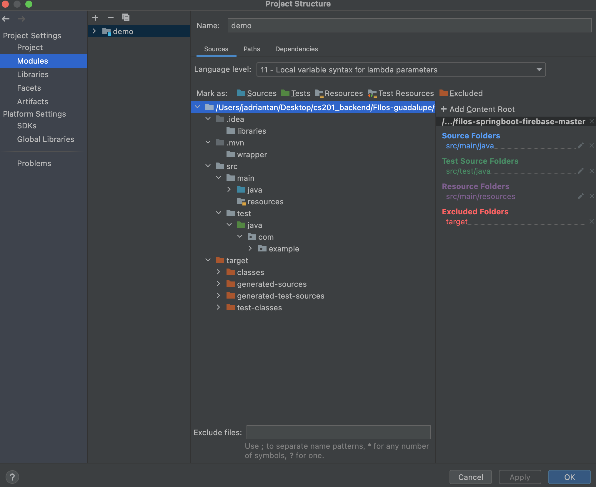

Instructions on How to Run Filos on Your Machine 

--------
SOFTWARE
--------
* This program requires the installation of two programs:
    a. VS Code 
    b. IntelliJ IDEA Ultimate (paid version)(free for USC Students)

-----------
INSTRUCTION
-----------
1. Unzip folder
2. Open backend-JavaSpring_Firebase folder in VSCode
3. Open frontend-React folder in IntelliJ IDEA Ultimate
    
VS Code: 
4. On VS Code's terminal, enter these commands:
    - 'npm install' 
    - 'npm start' 

IntelliJ IDEA Ultimate:
5. On the top left, click on file -> Project Structure...
6. In Project Structure...:
    - Modules 
    - Right-click on the specified folders to their respective type 
        - a. src/main/java      -->  Sources
        - b. src/test/java      -->  Tests
        - c. src/main/resources -->  Resources
    - 
7. Run SpringBoot by clicking on the "run" icon on the top right 
